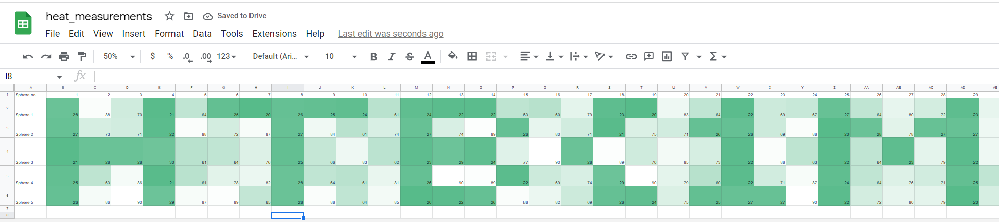

# [Cyber Apocalypse CTF 2022 from HackTheBox](../) - Matrioshka Brain

* **Category:** Misc
* **Points:** 325 points

## Challenge

> The possibility of a weapon that alters the very core of the structure of the universe itself is beyond even the wildest imaginations. Or is it? Ramona and Paulie are exeperimenting with concentric Dyson spheres to achieve the impossible, to harvest the energy of an entire quasar in order to create such a weapon. The exepriments showed that five spheres are the optimal solution. Alas, the thermal equilibrium is still a pressing issue they need to figure out. They measure the temperature of each sphere for every minute. Now all that is left is to properly analyze the data and figure out why there are so many thermal inconsistencies.


## TL;DR
Create a heatmap of the CSV values in Google Sheets to reveal the flag.

## Solution

The challenge provides a CSV [heat_measurements.csv](heat_measurements.csv), with 5 spheres and their temperatures over time. I thought about doing some crazy stuff, like using the data to an image and the fluctations over time. 

Then, the name of the csv triggered me just to create a heat map.

1. Import the csv into Google Sheets
2. Use Format -> Conditional Formatting -> Color Scale across the Range.
3. Adjust the Rows to be a little taller and zoom out, and you should see the flag.

[]

```
HTB{1MM3NS3_3N3RGY_1MM3NS3_H34T}
```