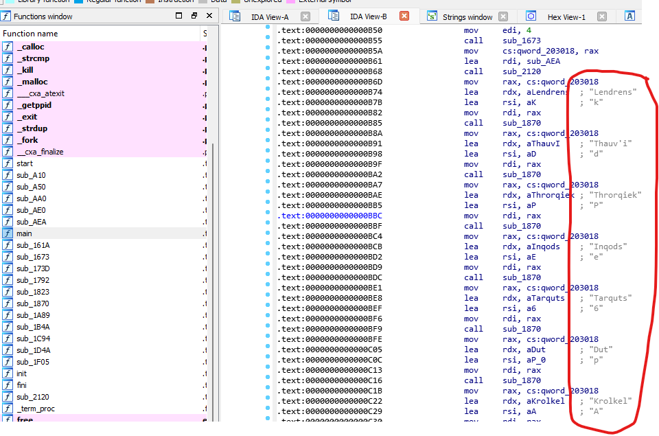

# [Cyber Apocalypse CTF 2022 from HackTheBox](../) - Omega One

* **Category:** Reversing
* **Points:** 300 points

## Challenge

> You've been sent to the library planet Omega-One. Here, records from all over the galaxy are collected, sorted and archived with perfect efficiency. You need to retrieve records about Draeger's childhood, but the interface is impossibly large. Can you unravel the storage system?


## TL;DR
Open the binary in IDA, and find a map of words to characters. Use that map to translate [output.txt](output.txt) into the flag.



## Solution

Coming Soon

```
HTB{forgot to save the flag..}
```