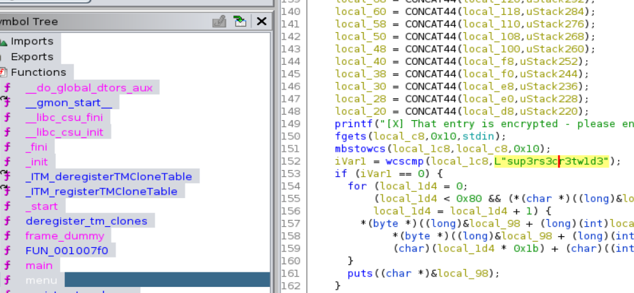

# [Cyber Apocalypse CTF 2022 from HackTheBox](../) - Omega One

* **Category:** Reversing
* **Points:** 300 points

## Challenge

> We've received reports that Draeger has stashed a huge arsenal in the pocket dimension Flaggle Alpha. You've managed to smuggle a discarded access terminal to the Widely Inflated Dimension Editor from his headquarters, but the entry for the dimension has been encrypted. Can you make it inside and take control?


## TL;DR
Open the binary in Ghidra, and find the super secret decryption key for option 6 in the menu function.



## Solution

Coming Soon

```
[X] That entry is encrypted - please enter your WIDE decryption key: sup3rs3cr3tw1d3
HTB{str1ngs_4r3nt_4lw4ys_4sc11}
```